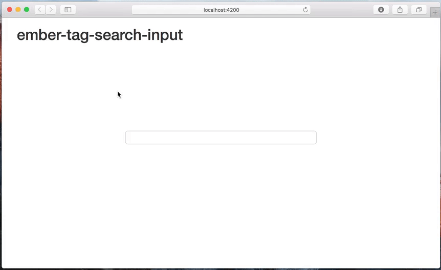

# Ember Tag Search Input

## Demo



## Basic Usage

```hbs
{{tag-search-input
  placeholder='Search for objects'
  modifierConfig=config
  inputValue=model.queryString
  isPopupHidden=isSearchPopupHidden
  valueChange=(action 'searchValueChange')
  modifierAutoComplete=(action 'modifierAutoComplete')
  enter=(action 'search')
  focus-in=(action 'inputFocusedIn')
  focus-out=(action 'inputFocusedOut')
}}
```

## tag-search-input Options

Option                 | Detail
-----------------------|----------------------
placeholder            | Simple placeholder displayed when input has no value
modifierConfig         | Config object used for getting modifiers
inputValue             | Initial and bound value of input
isPopupHidden          | Can be used to hide popups
valueChange            | Fired when inputValue changes (arguments: 1:newValue)
modifierAutoComplete   | Fired when the modifier has a valid value (arguments: 1:newValue, 2:modifierValue)

## Install

* `ember install ember-tag-search-input`

## Development

* `git clone https://github.com/inprod/ember-tag-search-input.git`
* `npm install`
* `bower install`
* `ember server`
* Visit your app at http://localhost:4200.

## Building

* `ember build`

For more information on using ember-cli, visit [http://www.ember-cli.com/](http://www.ember-cli.com/).
